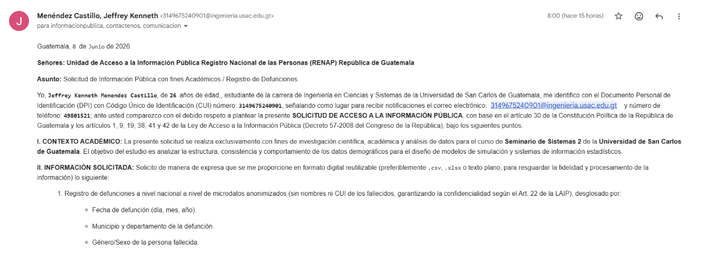
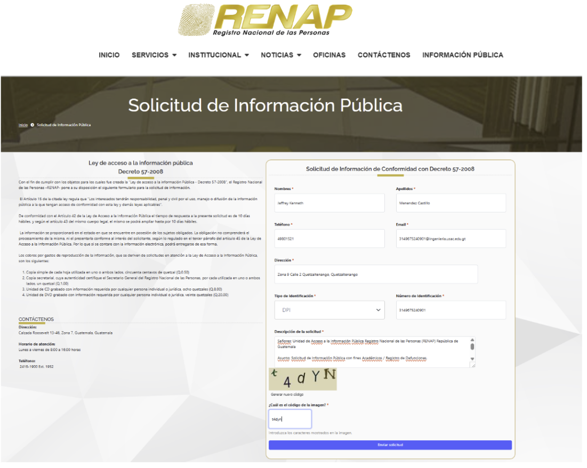
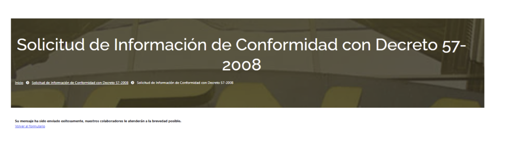

# Catálogo de Fuentes de Datos

Este catálogo documenta todas las fuentes de datos utilizadas en el proyecto, su procedencia, mecanismo de acceso y estado de disponibilidad. Cada fuente fue evaluada en términos de cobertura temporal, geográfica y calidad de los datos.

---

## Inventario y procedencia de datasets

### MSPAS — Ministerio de Salud Pública y Asistencia Social

Los datos del MSPAS provienen del portal de datos abiertos del gobierno de Guatemala. Se obtienen tres conjuntos de datos relacionados con mortalidad y causas de defunción:

| ID  | Dataset                                  | URL de origen                                    | Formato | Cobertura temporal | Cobertura geográfica |
| --- | ---------------------------------------- | ------------------------------------------------ | ------- | ------------------ | -------------------- |
| F01 | Casos y defunciones por COVID-19         | [datos.mspas.gob.gt](https://datos.mspas.gob.gt) | CSV     | 2020–2023          | Guatemala            |
| F02 | Defunciones por causa de muerte (CIE-10) | [datos.mspas.gob.gt](https://datos.mspas.gob.gt) | CSV     | 2015–2023          | Guatemala            |
| F03 | Estadísticas de mortalidad — SIGSA       | [datos.mspas.gob.gt](https://datos.mspas.gob.gt) | CSV     | 2015–2023          | Guatemala            |

**Mecanismo de acceso:** Los archivos CSV son descargados desde Dropbox (repositorio compartido por el equipo) mediante autenticación OAuth 2.0. El proceso de ingesta automatizada se documenta en [pipeline_dropbox_mspas.md](pipeline_dropbox_mspas.md).

---

### INE — Instituto Nacional de Estadística

Los datos del INE corresponden a las Estadísticas Vitales de Defunciones, fuente obligatoria según el enunciado del proyecto.

| ID  | Dataset                                               | URL de origen                                                                                                                  | Formato | Cobertura temporal | Cobertura geográfica |
| --- | ----------------------------------------------------- | ------------------------------------------------------------------------------------------------------------------------------ | ------- | ------------------ | -------------------- |
| F04 | Estadísticas Vitales — Defunciones (reportes anuales) | [datos.ine.gob.gt/dataset/estadisticas-vitales-defunciones](https://datos.ine.gob.gt/dataset/estadisticas-vitales-defunciones) | XLSX    | 2013–2022          | Guatemala            |
| F05 | Estadísticas Vitales — Defunciones (microdatos)       | [datos.ine.gob.gt/dataset/estadisticas-vitales-defunciones](https://datos.ine.gob.gt/dataset/estadisticas-vitales-defunciones) | CSV     | 2013–2022          | Guatemala            |

**Mecanismo de acceso:** Los archivos XLSX/CSV están almacenados en un bucket de AWS S3. La ingesta se realiza mediante la librería `boto3` con autenticación por IAM Role configurado en Databricks. El proceso se documenta en [pipeline_s3_ine.md](pipeline_s3_ine.md).

> **Fuente obligatoria del enunciado:** El proyecto exige usar como fuente base los datos de [estadísticas vitales de defunciones del INE](https://datos.ine.gob.gt/dataset/estadisticas-vitales-defunciones).

---

### OMS / WHO — Organización Mundial de la Salud

Los datos de la OMS provienen del portal WHO Mortality Database, con datos de mortalidad desagregados por causa (CIE-10), sexo, edad y año para Guatemala y Costa Rica.

| ID  | Dataset                             | URL de origen                                                                                                                                      | Formato | Cobertura temporal | Cobertura geográfica |
| --- | ----------------------------------- | -------------------------------------------------------------------------------------------------------------------------------------------------- | ------- | ------------------ | -------------------- |
| F06 | WHO Mortality Database — Guatemala  | [platform.who.int/mortality/countries/country-details/MDB/guatemala](https://platform.who.int/mortality/countries/country-details/MDB/guatemala)   | CSV     | 2015–2022          | Guatemala            |
| F07 | WHO Mortality Database — Costa Rica | [platform.who.int/mortality/countries/country-details/MDB/costa-rica](https://platform.who.int/mortality/countries/country-details/MDB/costa-rica) | CSV     | 2015–2022          | Costa Rica           |

**Mecanismo de acceso:**

- **Guatemala (F06):** Archivo CSV almacenado en un volumen local de Databricks (DBFS/Volume). La lectura se realiza directamente desde la ruta del volumen. Proceso documentado en [pipeline_local_dbfs.md](pipeline_local_dbfs.md).
- **Costa Rica (F07):** Archivo CSV almacenado en Google Drive del equipo. La ingesta se realiza mediante la API de Google Drive con autenticación por Service Account. Proceso documentado en [pipeline_oms_gdrive.md](pipeline_oms_gdrive.md).

---

### RENAP — Registro Nacional de las Personas

RENAP es custodio de los registros civiles de nacimientos, matrimonios y defunciones en Guatemala. Para el proyecto, se requieren los registros de defunciones como fuente complementaria de validación.

| ID  | Dataset                        | Estado                     | Observación                                                                                                                   |
| --- | ------------------------------ | -------------------------- | ----------------------------------------------------------------------------------------------------------------------------- |
| F08 | Registros de defunción — RENAP | Pendiente — oficio enviado | Fuente sujeta a solicitud de información pública según Art. 10 de la Ley de Acceso a la Información Pública (Decreto 57-2008) |

**Estado actual:** Se enviaron formalmente las solicitudes de información pública a RENAP. La evidencia se documenta en la sección siguiente.

---

## Evidencia de solicitud de información pública a RENAP

En cumplimiento con la **Ley de Acceso a la Información Pública (Decreto 57-2008)**, se realizó una solicitud formal de información a RENAP solicitando acceso a los registros de defunciones para fines académicos e investigativos.

### Correo electrónico enviado a RENAP

Se envió un correo electrónico a la Unidad de Información Pública de RENAP con la petición formal de acceso a los datos de defunciones.

---

### Formulario institucional de solicitud — Página 1

Se llenó el formulario oficial de solicitud de información pública de RENAP conforme al procedimiento establecido.

---

### Formulario institucional de solicitud — Página 2

Continuación y firma del formulario oficial de solicitud de información pública.

---

## Inventario de ingesta

A continuación se describen los cuatro mecanismos de ingesta implementados para incorporar datos a la capa Bronze/Sandbox del Data Warehouse en Databricks.

---

### 1. AWS S3 — INE (Estadísticas Vitales)

| Atributo               | Detalle                                          |
| ---------------------- | ------------------------------------------------ |
| **Fuente**             | INE — Estadísticas Vitales de Defunciones        |
| **IDs de dataset**     | F04, F05                                         |
| **Tecnología**         | `boto3` (AWS SDK para Python)                    |
| **Autenticación**      | IAM Role configurado en el cluster de Databricks |
| **Formato de entrada** | XLSX / CSV                                       |
| **Destino**            | Capa Bronze — tabla `bronze.ine_defunciones`     |
| **Documentación**      | [pipeline_s3_ine.md](pipeline_s3_ine.md)         |

**Descripción:** Los archivos de estadísticas vitales publicados por el INE se almacenan en un bucket S3. El notebook de Databricks utiliza `boto3` con las credenciales del IAM Role del cluster para listar y descargar los archivos, que luego son procesados y escritos en Delta Lake en la capa Bronze.

---

### 2. Dropbox — MSPAS

| Atributo               | Detalle                                                   |
| ---------------------- | --------------------------------------------------------- |
| **Fuente**             | MSPAS — Datos abiertos de mortalidad                      |
| **IDs de dataset**     | F01, F02, F03                                             |
| **Tecnología**         | Dropbox REST API v2                                       |
| **Autenticación**      | OAuth 2.0 — Access Token almacenado en Databricks Secrets |
| **Formato de entrada** | CSV                                                       |
| **Destino**            | Capa Bronze — tablas `bronze.mspas_*`                     |
| **Documentación**      | [pipeline_dropbox_mspas.md](pipeline_dropbox_mspas.md)    |

**Descripción:** Los archivos CSV del MSPAS están almacenados en una carpeta compartida de Dropbox. El notebook de Databricks autentica con OAuth 2.0 usando un token de acceso seguro (almacenado en Databricks Secret Scope) y descarga los archivos mediante la API REST de Dropbox (`/files/download`). Los archivos se escriben en Delta Lake en la capa Bronze.

---

### 3. Google Drive — OMS (Costa Rica)

| Atributo               | Detalle                                               |
| ---------------------- | ----------------------------------------------------- |
| **Fuente**             | WHO Mortality Database — Costa Rica                   |
| **IDs de dataset**     | F07                                                   |
| **Tecnología**         | Google Drive API v3 (`google-api-python-client`)      |
| **Autenticación**      | Google Service Account (archivo JSON de credenciales) |
| **Formato de entrada** | CSV                                                   |
| **Destino**            | Capa Bronze — tabla `bronze.oms_costa_rica`           |
| **Documentación**      | [pipeline_oms_gdrive.md](pipeline_oms_gdrive.md)      |

**Descripción:** El archivo CSV de mortalidad de Costa Rica (OMS) está almacenado en Google Drive. La ingesta utiliza `google-api-python-client` autenticado con un Service Account cuyas credenciales JSON están almacenadas de forma segura en Databricks. El archivo se descarga via `files().get_media()` y se escribe en la capa Bronze.

---

### 4. Volumen Local (DBFS) — OMS (Guatemala)

| Atributo               | Detalle                                             |
| ---------------------- | --------------------------------------------------- |
| **Fuente**             | WHO Mortality Database — Guatemala                  |
| **IDs de dataset**     | F06                                                 |
| **Tecnología**         | Spark / DBFS Volume read directo                    |
| **Autenticación**      | No requerida (acceso nativo al volumen del cluster) |
| **Formato de entrada** | CSV                                                 |
| **Destino**            | Capa Bronze — tabla `bronze.oms_guatemala`          |
| **Documentación**      | [pipeline_local_dbfs.md](pipeline_local_dbfs.md)    |

**Descripción:** El archivo CSV de mortalidad de Guatemala (OMS) fue cargado manualmente al volumen de Databricks (DBFS/Volumes). La ingesta consiste en una lectura directa del archivo desde la ruta del volumen usando Spark, sin necesidad de autenticación adicional. Es el mecanismo más simple y se usa para datos que no tienen una fuente de descarga automatizable.

---

## Resumen de fuentes

| ID  | Fuente                            | Institución | Formato | Mecanismo de ingesta           | Cobertura temporal | Cobertura geográfica | Estado    |
| --- | --------------------------------- | ----------- | ------- | ------------------------------ | ------------------ | -------------------- | --------- |
| F01 | COVID-19 casos y defunciones      | MSPAS       | CSV     | Dropbox OAuth 2.0 → Databricks | 2020–2023          | Guatemala            | Activa    |
| F02 | Defunciones por CIE-10            | MSPAS       | CSV     | Dropbox OAuth 2.0 → Databricks | 2015–2023          | Guatemala            | Activa    |
| F03 | Mortalidad SIGSA                  | MSPAS       | CSV     | Dropbox OAuth 2.0 → Databricks | 2015–2023          | Guatemala            | Activa    |
| F04 | Estadísticas Vitales — reportes   | INE         | XLSX    | AWS S3 + boto3 → Databricks    | 2013–2022          | Guatemala            | Activa    |
| F05 | Estadísticas Vitales — microdatos | INE         | CSV     | AWS S3 + boto3 → Databricks    | 2013–2022          | Guatemala            | Activa    |
| F06 | WHO Mortality Database            | OMS         | CSV     | DBFS Volume → Databricks       | 2015–2022          | Guatemala            | Activa    |
| F07 | WHO Mortality Database            | OMS         | CSV     | Google Drive API → Databricks  | 2015–2022          | Costa Rica           | Activa    |
| F08 | Registros de defunción            | RENAP       | TBD     | TBD                            | TBD                | Guatemala            | Pendiente |
