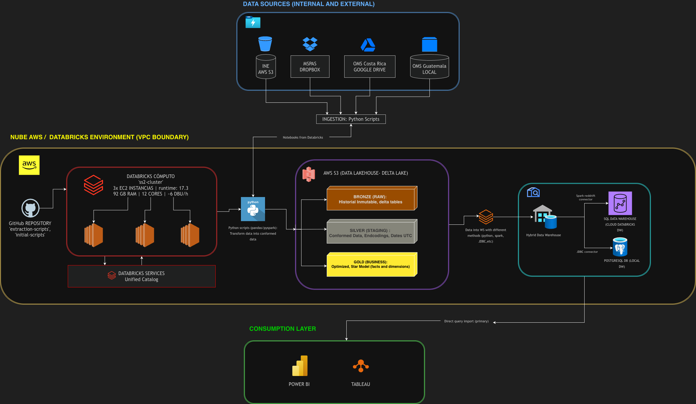
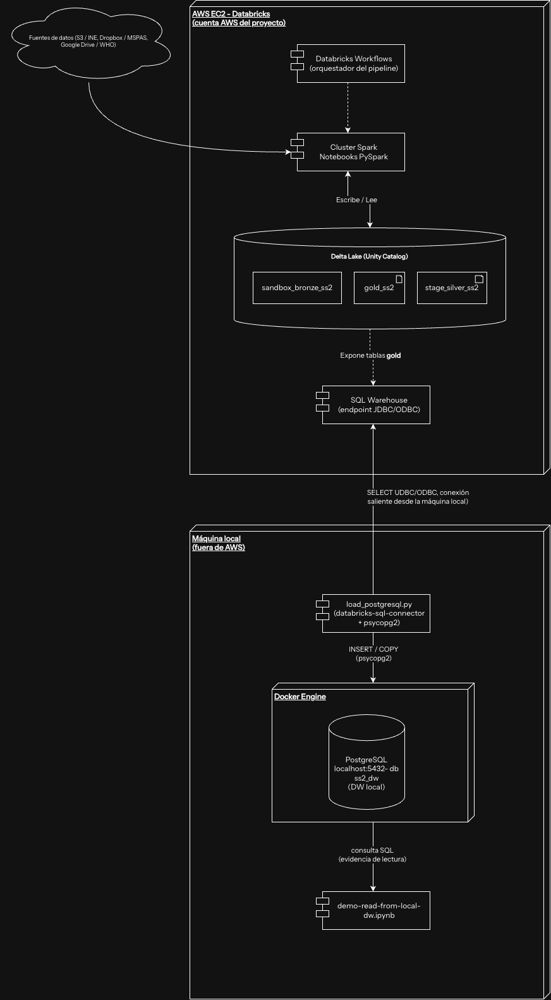
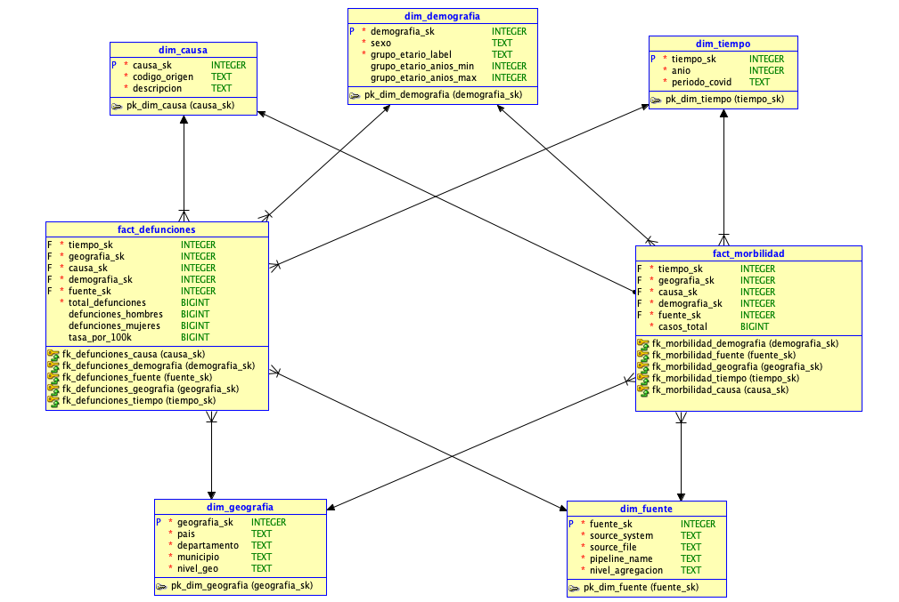

# Arquitectura — Fase 2

## Visión general

Fase 2 extiende el pipeline de Fase 1 (ingesta a Bronze) con dos capas
adicionales — **Silver** (limpieza y normalización) y **Gold** (modelo
dimensional) — y agrega un **Data Warehouse local** en PostgreSQL como
copia interoperable del Gold que vive en Databricks/Unity Catalog.

```
sandbox_bronze_ss2 (Delta, Unity Catalog)       ← Fase 1, ya poblado
        │  PySpark — Databricks Workflows
        ▼
stage_silver_ss2 (Delta, Unity Catalog)         ← Silver: limpieza, tipado, marcado
        │
        ▼
gold_ss2 (Delta, Unity Catalog)                 ← Gold: star schema
        │                 │
        ▼                 ▼
[Databricks Gold     Script Python local
 ya es el DW cloud]  (psycopg2 / COPY)
                          │
                          ▼
                    PostgreSQL Docker           ← DW local
                    + demo-read script          ← evidencia de lectura
```

## Decisión de arquitectura



Databricks/Unity Catalog actúa como el **DW en la nube** — no se
introduce un Redshift adicional, a diferencia de lo planteado
originalmente en Fase 1. El **DW local** es PostgreSQL corriendo en
Docker, cargado desde un script Python local (no JDBC desde
Databricks: Databricks corre en AWS y no tiene visibilidad de
`localhost`). La orquestación completa corre en **Databricks
Workflows** — no se usan GitHub/GitLab Actions para los jobs de datos.

## Diagrama de Despliegue

El diagrama anterior muestra el flujo lógico de datos por capas. El
siguiente diagrama de despliegue muestra la **topología física**: qué
corre dentro de la cuenta AWS del proyecto (cluster Spark de Databricks
sobre EC2) y qué corre fuera de AWS, en la máquina local.



Puntos clave:

- El **cluster Spark de Databricks corre sobre instancias EC2** dentro de
  la cuenta AWS del proyecto — no es infraestructura propia del equipo.
- Databricks **no tiene visibilidad de `localhost`**, pero la máquina
  local sí puede iniciar una conexión saliente hacia afuera. Por eso la
  carga al DW local no exporta Gold a archivos intermedios: el script
  `load_postgresql.py` lee las tablas `gold_ss2` directamente vía
  **`databricks-sql-connector`** contra el **SQL Warehouse** de Databricks
  (JDBC/ODBC), y luego inserta esos datos en PostgreSQL con `psycopg2`.
- `demo-read-from-local-dw.ipynb` ejecuta la consulta analítica final
  contra PostgreSQL local — la evidencia de lectura exigida por el
  criterio de aceptación.

## Capas

| Capa | Motor | Esquema Unity Catalog | Responsabilidad |
|------|-------|------------------------|------------------|
| Bronze | Delta Lake | `sandbox_bronze_ss2` | Datos crudos tal como llegan de cada fuente (Fase 1) |
| Silver | Delta Lake / PySpark | `stage_silver_ss2` | Tipado correcto, normalización de códigos, filtrado de subtotales estructuralmente inútiles, auditoría |
| Gold | Delta Lake / PySpark | `gold_ss2` | Modelo dimensional (star/galaxy schema): 2 fact tables + 5 dimensiones compartidas |
| DW local | PostgreSQL (Docker) | `ss2_dw` | Copia del Gold para evidencia de lectura fuera de Databricks y backup secundario |

Las reglas de transformación aplicadas en Silver están documentadas en
detalle en [Reglas de Transformación](reglas_transformacion.md).

## Modelo dimensional (Gold) — Galaxy Schema

El modelo Gold se diseñó como **galaxy schema** (dos fact tables que
comparten las mismas cinco dimensiones) en lugar de un único star schema,
porque las dos fuentes principales —mortalidad (INE + WHO) y morbilidad
(MSPAS)— reportan medidas no comparables y tienen grain distinto. Ver
[Issues Críticos](#por-que-dos-fact-tables) más abajo para el detalle de
esta decisión.



*Diagrama ERD generado en Oracle SQL Data Modeler — capa Gold (`gold_ss2`).*

### Tablas de hechos

| Fact table | Grain | Fuentes | Medida principal |
|------------|-------|---------|-------------------|
| `fact_defunciones` | una fila por (tiempo, geografía, causa, demografía, fuente) | INE (5 tablas) + WHO (2 tablas) | `total_defunciones`, `defunciones_hombres`, `defunciones_mujeres`, tasas WHO |
| `fact_morbilidad` | una fila por (tiempo, geografía, causa, demografía, fuente) | MSPAS (3 tablas `dbx_*`) | `casos_total` |

### Dimensiones compartidas

| Dimensión | Grano | Notas |
|-----------|-------|-------|
| `dim_tiempo` | año | Granularidad anual en todas las fuentes; incluye `periodo_covid` (`pre_covid` ≤2019 / `covid_y_post` ≥2020) |
| `dim_geografia` | país / departamento / municipio | `nivel_geo` distingue el nivel de agregación; fila placeholder `('Guatemala', 'Sin desagregar')` para fuentes sin geografía (INE-edad) |
| `dim_causa` | código de causa unificado | `codigo_origen` normaliza el mejor código disponible por fuente (CIE-10 normalizado, rango de causas externas, o indicador OMS) |
| `dim_demografia` | sexo + grupo etario | Fila placeholder `('Ambos', 'Sin desagregar')` para fuentes sin esa desagregación |
| `dim_fuente` | sistema de origen | Reutiliza columnas de linaje (`source_system`, `source_file`) que vienen desde Bronze |

### Por qué dos fact tables

| Razón | Detalle |
|-------|---------|
| Medidas incomparables | MSPAS reporta `casos` (eventos de enfermedad, no necesariamente fatales); INE reporta `defunciones`; WHO reporta tasas derivadas. Sumarlas en una sola columna `valor` sería propenso a errores de interpretación en BI |
| Grain distinto | MSPAS llega a nivel municipio; INE-edad no tiene geografía; WHO no tiene departamento — forzar un grain común degradaría la granularidad de todas las fuentes |
| Evolución independiente | Si se incorpora RENAP en Fase 3, el cambio queda aislado a `fact_defunciones` sin tocar `fact_morbilidad` |

!!! warning "Riesgo de doble conteo en `fact_defunciones`"
    INE-edad (con `edad`, sin departamento) e INE-geografía (con
    departamento, sin `edad`) son dos cortes distintos de **las mismas
    defunciones** a nivel nacional, y ambos alimentan `fact_defunciones`.
    Si se agrega `total_defunciones` sin filtrar por
    `dim_fuente.source_system`, se cuentan dos veces las mismas muertes.
    Toda consulta analítica sobre `fact_defunciones` debe filtrar por
    fuente o elegir un único corte según el análisis deseado.

## Infraestructura del DW local

Databricks corre en AWS y no puede conectarse directamente a un
PostgreSQL en `localhost`. El flujo de carga es:

```
Gold Delta en Databricks
    → notebook exporta tablas a Parquet en un Volume accesible
    → script Python local (load_postgresql.py) lee esos Parquets
    → psycopg2 / COPY → PostgreSQL Docker
```

- `docker-compose.yml` + `initial-scripts/postgres-ddl.sql` levantan el
  esquema estrella en PostgreSQL (`localhost:5432`, base `ss2_dw`).
- `transformation-scripts/load/load_postgresql.py` ejecuta la carga vía
  `COPY` desde los Parquets exportados.
- `transformation-scripts/load/demo-read-from-local-dw.ipynb` ejecuta una
  consulta analítica real contra el DW local como evidencia de lectura —
  ver [Evidencia de lectura del DW local](evidencia_dw_local.md).

El backup del DW (capa primaria en Parquet + copia en PostgreSQL local)
está documentado en [Backup del DW](backup_dw.md).

## Orquestación

Todos los pasos —ingesta Bronze, transformaciones Silver, construcción de
dimensiones y fact tables en Gold, y carga al DW local— se encadenan en un
único Databricks Workflow (`ss2_pipeline_fase2`):

```
bronze_*  →  silver_* (paralelo)  →  gold_dim_* (paralelo)  →  gold_fact_*  →  load_postgres
```

Todos los notebooks Silver y Gold escriben con `mode("overwrite")`, por lo
que re-ejecuciones del Workflow son idempotentes y seguras.
