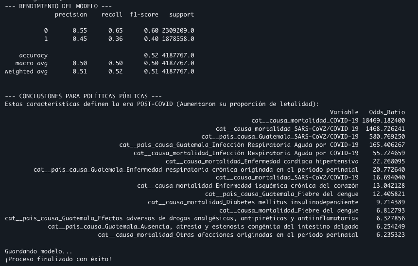

# Análisis — Mortalidad y Morbilidad Pre/Post-COVID

**Análisis estructural de mortalidad y morbilidad Pre y Post-COVID-19 —
un enfoque descriptivo e inferencial sobre el impacto de la pandemia en
Guatemala.**
*Grupo 10 — Seminario de Sistemas 2, USAC (Junio 2026).*

## Resumen ejecutivo

La investigación analizó la evolución de la mortalidad y morbilidad en
Guatemala con una comparativa equitativa de 5 años: el periodo
**Pre-COVID (2015-2019)** frente al periodo de la era pandémica y su
estabilización, **Post-COVID (2020-2024)**. Combinando Inteligencia de
Negocios (dashboards) con un modelo de inferencia estadística
—**Regresión Logística Ponderada con regularización Lasso L1**— se aisló
el "ruido" estadístico para identificar las anomalías causadas por la
pandemia.

El hallazgo central trasciende el impacto directo del virus: **la
pandemia funcionó como un catalizador que exacerbó deficiencias
estructurales preexistentes**. El contraste de los datos revela una
reestructuración completa de los patrones de supervivencia del país: la
carga de morbilidad pasó de afectar principalmente a la primera infancia
(Pre-COVID) a ser letal para adultos mayores crónicos (Post-COVID),
detonando epidemias paralelas no atendidas y alterando permanentemente el
volumen de mortalidad histórico.

!!! note "Nota metodológica"
    Los datos del año 2025 se excluyeron del promedio comparativo: solo
    cuentan con el primer trimestre registrado, lo que distorsionaría las
    tasas anualizadas.

## 1. Hallazgos principales

### 1.1 El shock del volumen y la desigualdad sistémica

La validación del contraste absoluto en periodos de 5 años expone la
magnitud del colapso del sistema nacional de salud:

| Indicador | Pre-COVID (2015-2019) | Post-COVID (2020-2024) |
|-----------|-----------------------|-------------------------|
| Defunciones acumuladas (5 años) | 704,000 | 873,970 |
| Promedio anual | ~140,800 | ~174,794 |

- **Shock de volumen acumulado** — el incremento de casi **170,000 vidas
  perdidas** expone el saldo sistémico de la emergencia.
- **Brecha regional estructural** — Guatemala ya operaba con desventaja
  histórica: mantenía una brecha de **~−10 puntos** frente a Costa Rica
  antes de la crisis.
- **Pico pandémico** — en 2021 la tasa alcanzó **51.60 × 100k**
  habitantes (**+33%** sobre el máximo histórico de 2015), ensanchando la
  brecha con Costa Rica a **−14 puntos**. Aunque 2022 trajo recuperación
  (39.43), el promedio Post-COVID se asentó en **44.84**, confirmando que
  el daño sistémico alteró permanentemente la línea base del país.

### 1.2 La paradoja de la morbilidad y el salto cardiovascular

El cruce de la línea base descriptiva con la inferencia probabilística
revela un comportamiento epidemiológico atípico:

- **Menos enfermos, mayor letalidad** — los casos totales de morbilidad
  cayeron de **57 M** (Pre-COVID) a **52 M** (Post-COVID). Las afecciones
  respiratorias generales, que dominaban las consultas, cayeron un **31%**
  por el distanciamiento social.
- **El colapso crónico** — las enfermedades cardiovasculares pasaron de
  representar el **4.1%** de la morbilidad (Pre-COVID) a un **20%**
  (Post-COVID).

El modelo Lasso (**Accuracy 52%**, validando que la mortalidad base del
país se mantuvo constante) confirmó este hallazgo aislando un aumento
explosivo en la letalidad de enfermedades crónicas no transmisibles:

| Causa | Odds Ratio |
|-------|-----------:|
| Enfermedad cardíaca hipertensiva | 22.26 |
| Enfermedad isquémica crónica del corazón | 13.04 |
| Diabetes mellitus insulinodependiente | 9.71 |

!!! abstract "Inferencia"
    La focalización del sistema de salud en la contención del virus
    provocó un **abandono letal de pacientes crónicos**. Comorbilidades
    antes manejables (hipertensión, diabetes) pasaron a ser causas de
    mortalidad directa por la falta de control médico regular durante la
    crisis y los años posteriores.

### 1.3 Desplazamiento demográfico: de la infancia a la tercera edad

- **Pre-COVID** — la carga de morbilidad estaba hiperconcentrada en la
  primera infancia (1 a 4 años y menores de 1 mes).
- **Post-COVID** — el impacto letal se invirtió hacia la cúspide de la
  pirámide. El grupo de **85+ años** fue el más impactado y, en general,
  la pandemia castigó desproporcionadamente a todos los estratos mayores
  de 60 años — correlación directa con el abandono del tratamiento crónico
  (§1.2).

### 1.4 Crisis perinatal y sindemia de dengue

El modelo de ML reveló vulnerabilidades colaterales que pasaron
inadvertidas:

- **Retroceso materno-infantil** — pese a la caída en morbilidad infantil
  general, las defunciones neonatales críticas aumentaron: enfermedad
  respiratoria crónica originada en el período perinatal (**OR 20.77**) y
  ausencia/atresia congénita del intestino delgado (**OR 6.25**) muestran
  graves deficiencias en cirugía pediátrica de emergencia y cuidados
  intensivos neonatales (UCIN).
- **Fenómeno sindémico** — el incremento de letalidad por Fiebre del
  Dengue (**OR 12.40** departamental, **6.81** general) expone brotes
  vectoriales simultáneos que agotaron la vigilancia epidemiológica.

### 1.5 Automedicación letal y el eje geográfico

- **Automedicación letal** — el algoritmo detectó un aumento anómalo en
  muertes por efectos adversos de drogas analgésicas, antipiréticas y
  antiinflamatorias (**OR 6.32**). Ante el colapso hospitalario y el temor
  al contagio, la población recurrió masivamente a cócteles
  farmacológicos caseros, derivando en intoxicaciones agudas.
- **Eje de Occidente** — el mapa de defunciones destaca un desplazamiento
  hacia el occidente del país. Después de Guatemala, **Quetzaltenango y
  San Marcos** se perfilaron como los nuevos epicentros críticos de
  letalidad, superando históricamente a Escuintla.

## Evidencia del modelo (SageMaker)

Salida de consola del modelo de Regresión Logística Lasso entrenado en
AWS SageMaker: reporte de clasificación (Accuracy 0.52 sobre 4,187,767
registros) y los Odds Ratio de las variables que definen la era
Post-COVID.

## 2. Recomendaciones de política pública

Con base en la evidencia contrastada, se proponen estas intervenciones
para el **MSPAS** y la **SEGEPLAN**:

**I. Descentralización de la atención crónica (modelo "Doble Vía").**
El salto de morbilidad cardiovascular (4.1% → 20%) exige blindar Centros
de Atención Permanente (CAPs) exclusivos para enfermedades no
transmisibles y reforzar farmacias municipales para la entrega
ininterrumpida de antihipertensivos e insulina, evitando que los
pacientes crónicos (especialmente mayores de 60 años) acudan a centros de
alto contagio.

**II. Reestructuración geográfica del presupuesto (prioridad Occidente).**
El cambio en el mapa de calor exige focalizar la inversión hacia el
occidente: modernizar los Hospitales Nacionales Regionales de
Quetzaltenango y San Marcos con redes de oxígeno independientes y mayor
capacidad de camas UCI.

**III. Blindaje del ecosistema materno-infantil y congénito.**
Emitir un decreto ministerial que declare maternidad, cirugía pediátrica
de emergencia y Cuidados Intensivos Neonatales como **infraestructura
crítica no reasignable** bajo ninguna declaratoria de emergencia
sanitaria.

**IV. Regulación farmacológica y alfabetización preventiva.**
Ante las muertes por automedicación: (a) fiscalización de contingencia
sobre la venta de antiinflamatorios sistémicos y antibióticos de amplio
espectro durante emergencias, y (b) campañas de prevención comunitaria
**bilingües (español e idiomas mayas)** sobre los riesgos hepáticos y
renales de las combinaciones empíricas de fármacos.

**V. Homologación logística regional (cierre de brecha).**
La desventaja histórica frente a Costa Rica confirma que la
vulnerabilidad es estructural. Instaurar mesas técnicas centroamericanas
para auditar y homologar protocolos de respuesta logística y
escalabilidad de camas, y generar una hoja de ruta para aumentar
progresivamente el gasto público en salud como porcentaje del PIB.
