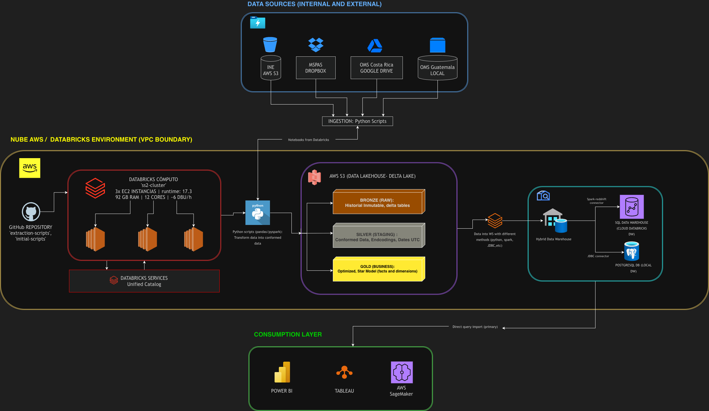
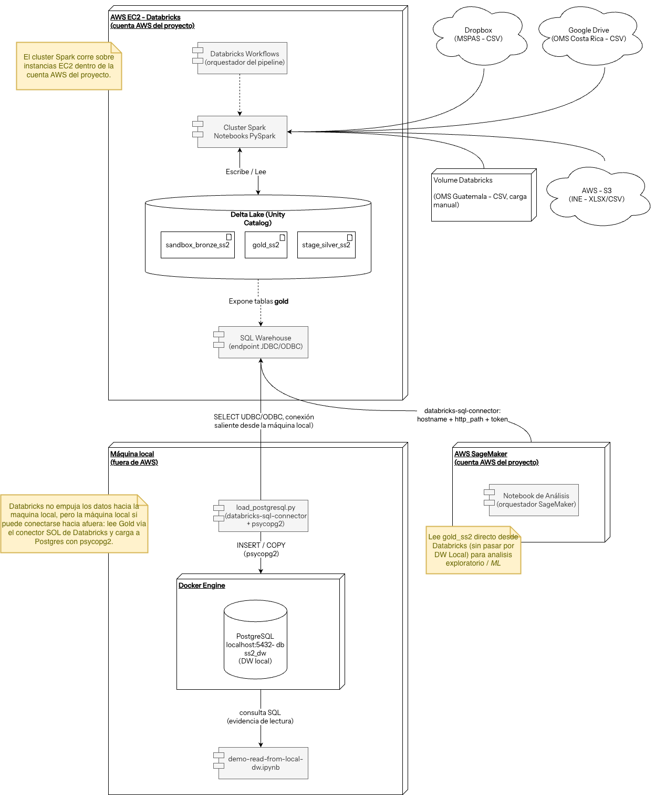

# Arquitectura — Fase 3

## Visión general

La Fase 3 **no modifica el pipeline de datos** construido en fases
anteriores (ingesta a Bronze → Silver → Gold sobre Databricks/Unity
Catalog, más el DW local en PostgreSQL). Lo que cambia es la **capa de
consumo**: el modelo dimensional Gold (`gold_ss2`), ya estable, pasa a
ser la fuente única para tres consumidores analíticos —Machine Learning
en **AWS SageMaker** y dos herramientas de BI, **Power BI** y
**Tableau**.

En otras palabras, Fase 1 y Fase 2 dejaron listo el *qué* (los datos
limpios y modelados); Fase 3 explota ese activo para responder el *para
qué*: comparación de mortalidad Pre/Post-COVID, modelos predictivos y
tableros interactivos.

## Arquitectura final

*Arquitectura end-to-end con la capa de consumo de Fase 3 resaltada.*

El diagrama mantiene las tres zonas ya conocidas y formaliza una cuarta:

| Zona | Componentes | Estado en Fase 3 |
|------|-------------|------------------|
| **Data Sources** | INE (AWS S3), MSPAS (Dropbox), WHO Costa Rica (Google Drive), WHO Guatemala (carga local) | Sin cambios — ingesta vía scripts Python a Bronze |
| **Databricks / VPC AWS** | Databricks Compute (cluster Spark sobre EC2), Unity Catalog, Delta Lake S3 con capas Bronze / Silver / Gold | Sin cambios — Gold ya poblado y estable |
| **Consumption Layer** | **Power BI**, **Tableau**, **AWS SageMaker** | **Capa protagonista de Fase 3** |

## Qué cambia respecto a Fase 2

La topología de ingesta y transformación es idéntica a la documentada en
[Arquitectura — Fase 2](../fase2/arquitectura.md). La única diferencia
arquitectónica es la **expansión de la capa de consumo**:

| Capa de consumo | Fase 2 | Fase 3 |
|-----------------|--------|--------|
| Power BI | ✅ | ✅ |
| Tableau | ✅ | ✅ |
| **AWS SageMaker (ML)** | — | ✅ **(nuevo)** |

SageMaker se incorpora como tercer consumidor de Gold. Lee `gold_ss2`
directamente desde Databricks (vía el SQL Warehouse, sin pasar por el DW
local) para análisis exploratorio y entrenamiento de modelos de ML.

## Diagrama de Despliegue

El diagrama anterior muestra el flujo lógico por zonas. El siguiente
diagrama de despliegue muestra la **topología física** —qué corre dentro
de la cuenta AWS del proyecto y qué corre fuera, en la máquina local— e
incluye **AWS SageMaker** como consumidor de Gold de Fase 3.

Puntos clave:

- El **cluster Spark de Databricks corre sobre instancias EC2** dentro de
  la cuenta AWS del proyecto. Las capas Bronze → Silver → Gold viven en
  Delta Lake (Unity Catalog) y se exponen vía el **SQL Warehouse**
  (endpoint JDBC/ODBC).
- Databricks **no tiene visibilidad de `localhost`**, pero la máquina
  local sí puede iniciar una conexión saliente. Por eso `load-postgresql.py`
  lee `gold_ss2` directo del SQL Warehouse vía `databricks-sql-connector`
  y carga PostgreSQL (Docker) con `psycopg2` — el **DW local**.
- **AWS SageMaker** (cuenta AWS del proyecto) lee `gold_ss2`
  **directamente** desde el SQL Warehouse —sin pasar por el DW local— para
  análisis exploratorio y ML. Es el consumidor que Fase 3 añade a la
  topología.

## Consumidores de Gold

Los tres consumidores leen del **mismo** modelo dimensional Gold, lo que
garantiza que ML y BI hablan sobre cifras idénticas:

| Consumidor | Conexión a Gold | Propósito en Fase 3 |
|------------|-----------------|----------------------|
| **AWS SageMaker** | `databricks-sql-connector` contra el SQL Warehouse (hostname + http_path + token) | Modelos de ML / análisis predictivo sobre mortalidad Pre/Post-COVID |
| **Power BI** | Conector nativo de Databricks (Power Query + DAX) | Tableros interactivos, KPIs y análisis comparativo Pre/Post-COVID |
| **Tableau** | Conector Databricks (JDBC/ODBC) | Segunda herramienta BI — visualización analítica e interoperabilidad |

!!! warning "Doble conteo en `fact_defunciones`"
    Igual que en BI, los modelos y consultas de Fase 3 sobre
    `fact_defunciones` deben filtrar por `dim_fuente.source_system` o
    elegir un único corte. INE-edad e INE-geografía son dos cortes de las
    **mismas** defunciones; sumarlos sin filtrar duplica las muertes.
    Ver el detalle en [Arquitectura — Fase 2](../fase2/arquitectura.md#por-que-dos-fact-tables).

## Por qué Gold como fuente única de ML y BI

- **Una sola verdad** — ML (SageMaker) y BI (Power BI, Tableau) consumen
  el mismo `gold_ss2`, así un dashboard y un modelo nunca contradicen las
  cifras del otro.
- **Sin re-ingesta** — Fase 3 no toca las fuentes ni el pipeline; reduce
  el riesgo y aísla el trabajo de ML/BI de la lógica de transformación.
- **Galaxy schema listo para análisis** — las dos fact tables y las cinco
  dimensiones compartidas ya resuelven grain, periodo COVID y linaje, por
  lo que los consumidores trabajan sobre datos modelados, no crudos.
