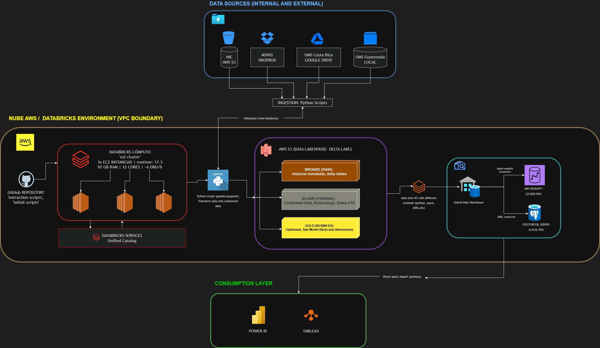

# Plataforma Analítica de Mortalidad End-to-End

**Seminario de Sistemas 2 — Laboratorio de Ingeniería de Datos**  
Universidad de San Carlos de Guatemala — Facultad de Ingeniería  
Catedrático: Ing. Marlon Orellana | Sección A | Escuela de Vacaciones 2026

---

## Links del proyecto

| Recurso | Enlace |
|---------|--------|
| Repositorio GitHub | [ss2-dw-project-covid-research](https://github.com/SofiaQuintana/ss2-dw-project-covid-research) |
| Databricks Workspace | [dbc-0a04799e-61f4.cloud.databricks.com](https://dbc-0a04799e-61f4.cloud.databricks.com/?o=7474654378976213) |
| S3 — Datos INE | `s3://ss2-ingestion-ine-datasets-raw/` |
| Google Drive — Datos OMS | [Carpeta Drive OMS](https://drive.google.com/drive/folders/1hWLtuZhnQJQ-8iRRL-acupDgLt0mhIQ-?usp=sharing) |
| Dropbox — Datos MSPAS | [/MSPAS en Dropbox](https://www.dropbox.com/home/MSPAS) |
| Diagrama de arquitectura (Draw.io en Drive) | [Ver en Drive](https://drive.google.com/file/d/1lyRLrrGM1ripTk24UDRu3TEEHOWBAU5L/view) |
| Diagrama de arquitectura (Draw.io directo) | [Abrir en diagrams.net](https://app.diagrams.net/#G1lyRLrrGM1ripTk24UDRu3TEEHOWBAU5L#%7B%22pageId%22%3A%22nYbiyOzKeAziMmEJtLo7%22%7D) |
| Documentación publicada | [sofiaquintana.github.io/ss2-dw-project-covid-research](https://sofiaquintana.github.io/ss2-dw-project-covid-research/) |

---

## Contexto del proyecto

Este proyecto diseña y construye una plataforma de datos End-to-End para analizar cómo cambiaron los
patrones de mortalidad en Guatemala entre el período **Pre-COVID (2015–2019)** y el
período **Post-COVID (2020 en adelante)**.

## Especificación de Arquitectura de Datos: Lakehouse Híbrido (Medallion Architecture)

Se detalla la arquitectura técnica, el stack de tecnologías y el flujo de datos de extremo a extremo para la ingesta, transformación, almacenamiento y consumo de datos utilizando una topología híbrida de tipo Medallion.

| Componente | Tecnología Seleccionada | Rol en la Arquitectura |
| :--- | :--- | :--- |
| **Capa de Cómputo y ETL** | Databricks + AWS | Orquestación, extracción de fuentes, procesamiento/limpieza de datos mediante Python y carga en paralelo. |
| **Lenguaje y Librerías** | Python 3.x (Pandas, boto3, PySpark) | Desarrollo de los pipelines de ingesta, consumo de APIs y conexiones correspondientes. |
| **Capa de Almacenamiento (layer bronze y silver)** | AWS S3 | Soporte físico y lógico de la Arquitectura Medallón. Almacenamiento de tablas delta con soporte transaccional ACID. |
| **Data Warehouse Principal (layer gold)** | AWS Redshift (Cloud) | Almacenamiento masivo optimizado para consultas analíticas corporativas y producción. |
| **Data Warehouse Réplica** | PostgreSQL (On-Premises / Local) | Repositorio local interoperable que garantiza alta disponibilidad y consultas internas sin latencia de red. |
| **Capa de Consumo y BI** | Power BI + Tableau | Creación de dashboards operativos y gerenciales conectados directamente a cualquiera de las instancias del data warehouse (cloud / on-premise). |

## Fases del proyecto

| Fase | Foco | Fecha |
|------|------|-------|
| **Fase 1** | Identificación, ingesta y sandbox | 12 Jun 2026 |
| **Fase 2** | Transformación y Data Warehouse | 19 Jun 2026 |
| **Fase 3** | Machine Learning y visualización BI | 26–30 Jun 2026 |

## Equipo

| Integrante | Identificación |
|------------|----------------|
| Sofía Alejandra Quintana Gutiérrez | 3301234591201 |
| Jeffrey Kenneth Menéndez Castillo | 3149675240901 |
| José Roberto Bautista Rojas | 2930462710901 |
